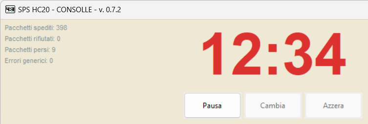
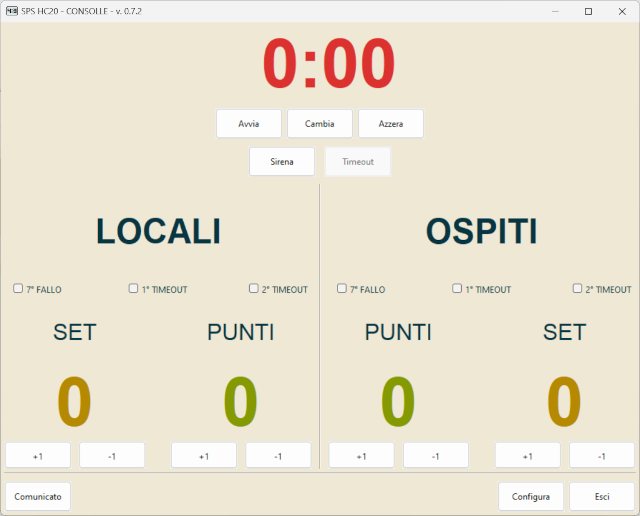
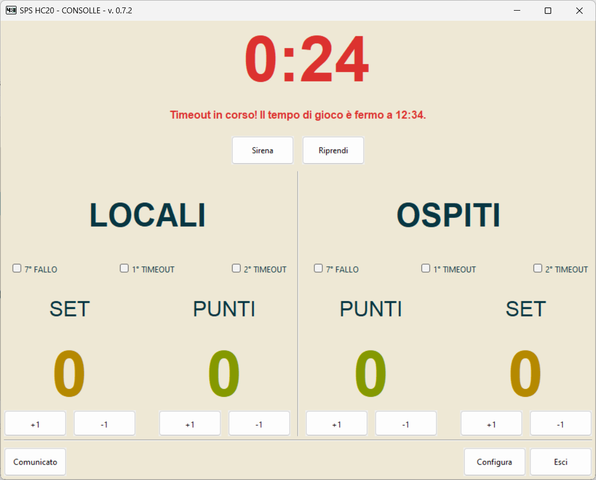
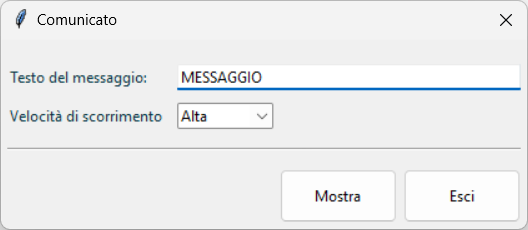

[//]: # (encoding=utf-8)

# SPS HC20 - Consolle v. 0.5

Il programma _Consolle_ emula la consolle di controllo del tabellone IBLE SPS
HC20.

## Prerequisiti

Affinché il programma possa comunicare con il circuito di controllo del
tabellone è necessaria la presenza dei driver della scheda Arduino. I sistemi
operativi più moderni (es. Windows 10 e le principali distribuzioni Linux con
kernel v. 2.6 o successivo) supportano nativamente i circuiti basati su
Arduino; in questo caso è sufficiente collegare il circuito di controllo al
computer ed attendere la conferma dell'avvenuto riconoscimento della scheda.
In caso problemi o di uso di sistemi operativi più datati bisogna procedere
all'installazione manuale dei driver, che si possono scaricare gratuitamente
dal sito ufficiale all'indirizzo
[https://www.arduino.cc](https://www.arduino.cc). La procedura di installazione
varia a seconda del sistema operativo usato. Si rimanda alle tante guide che si
trovano in rete, anche in italiano, per le istruzioni del caso.

## Predisposizione del sistema

Attenersi alla seguente procedura di avvio:

 1. accendere il computer;
 2. collegare il circuito di controllo a una presa USB del computer;
 3. avviare il programma;
 4. collegare il cavo del tabellone al circuito di controllo.

Per lo spegnimento, eseguire la procedura all'inverso.

## Configurazione iniziale

All'avvio del programma appare la maschera di configurazione:

I parametri della configurazione sono:

 * **Durata di un tempo**: durata di una frazione di gioco, espresso in minuti;

 * **Mostra lo zero iniziale nei minuti**: aggiunge lo zero delle decine quando
   il numero di minuti è inferiore a 10. Supponendo di trovarsi al minuto 7
   e 42 secondi di gioco, questa opzione consente di visualizzare l'orario
   **07:42** anziché **7:42**;

 * **Mostra i decimi di secondo nell'ultimo minuto**: mostra secondo, centesimo
   di secondo (arrotondato alla decina precedente) anzichè minuto, secondo nel
   contaminuti durante l'ultimo minuto di ogni frazione di gioco;

 * **Suona la sirena di fine tempo**: emette un suono di sirena della durata di
   un secondo al termine di ogni frazione di gioco;

 * **Suona la sirena di inizio timeout**: emette un suono di sirena della
   durata di un secondo alla chiamata di un timeout;

 * **Suona la sirena di imminente fine del timeout**: emette un suono di sirena
   della durata di un secondo a dieci secondi dal termine del timeout;

 * **Mostra le statistiche di comunicazione**: visualizza alcune statistiche
   riguardanti la comunicazione tra il programma e il circuito di interfaccia,
   utili nella diagnostica dei problemi relativi al controllo del tabellone:

   

 * **Nome del dispositivo**: identificativo della porta cui è collegato il
   circuito di controllo del tabellone. Su Windows è il nome di una porta
   seriale (es. **COM3**), su Linux il nome di un pseudo-terminale (es.
   **/dev/ttyACM0**).

Il programma salva i parametri nel file
_.sps-hc20_consolle.cfg_ che si trova tipicamente nella cartella
_C:\Users\%USERNAME%_ su Windows, nella cartella _$HOME_ su Ubuntu, per cui
la configurazione non viene persa alla chiusura del programma.

Nel caso non sia stato possibile stabilire la comunicazione con il circuito di
controllo (es. il circuito non è stato connesso al computer, il nome del
dispositivo specificato non è quello corretto, ...) appare un messaggio d'errore
che indica la natura del problema e spiega che il programma funzionerà comunque
ma senza tabellone:

Conviene a questo punto chiudere il programma e risolvere il problema
contingente. Se si desidera invece utilizzare il programma senza il circuito di
controllo del tabellone, conviene lasciare vuoto il nome del dispositivo; in
questo caso apparirà un messaggio che riconosce la volontà di procedere senza
tabellone:

## Maschera principale

La parte superiore della maschera contiene il contaminuti che è controllato dai
tre pulsanti dall'ovvio significato **Avvia** (**Pausa**), **Cambia** e
**Azzera**. Il pulsante **Sirena** aziona la sirena; il suono viene emesso
fintantoché il pulsante è premuto. Il pulsante **Timeout**, che è attivo
solamente durante il conteggio, attiva la modalità _timeout_ del programma.

La parte centrale della maschera contiene i dati relativi alle due squadre: i
controlli degli indicatori dei 7 falli e dei timeout, il numero di set vinti e
il punteggio corrente. Gli indicatori si accendono attivando la relativa
opzione, i conteggi del set e del punteggio si incrementano e decrementano con
gli appositi pulsanti.

La parte inferiore della maschera contiene i pulsanti di controllo del
programma: **Comunicato** consente di far apparire un testo scorrevole nei
quattro display del contaminuti (quelli rossi), **Configura** richiama la
maschera di configurazione iniziale, utile nel caso si voglia modificare il
funzionamento del programma "in corsa", **Esci** termina la sessione di lavoro.

## Uso del programma

L'uso del programma è in buona parte intuitivo. Ci sono tuttavia alcuni aspetti
sui quali vale la pena spendere due parole.

### Timeout

Il timeout può essere gestito in due modalità: arrestando il contaminuti con
il pulsante **Pausa**, oppure attraverso il pulsante **Timeout**. Nel
primo caso il tabellone mostrerà il minuto, secondo di inizio del timeout per
tutta la durata dell'interruzione, e il conteggio dovrà essere riavviato
premendo il pulsante **Avvia** alla ripresa del gioco comandata dall'arbitro.
Nel secondo caso, il tempo di gioco mostrato nel contaminuti viene sostituito
dal conteggio del minuto di timeout e, se la configurazione lo richiede, viene
emesso il suono di sirena di inizio timeout, dopodiché appare la maschera di
timeout:

Al raggiungimento del cinquantesimo secondo di timeout, sempre se richiesto
dalla configurazione, verrà emesso il suono di sirena di imminente fine del
timeout. Esaurito il minuto di timeout, sul contaminuti riapparirà il minuto,
secondo di interruzione del gioco. Il conteggio del tempo di gara ricomincierà
alla chiusura della maschera di timeout, **anche se il minuto di timeout non
è stato completato.**

### Comunicato

È possibile far apparire una scritta scorrevole sul contaminuti. Valutare bene
questa opportunità: trattandosi di display sette segmenti la rappresentazione
di alcuni caratteri (es. K, M, Q, R, U, V) può risultare di difficile
interpretazione. Una prova preliminare è d'obbligo.

Premendo il pulsante **Comunicato** appare la maschera omonima:

Impostato il testo del messaggio da visualizzare e la velocità di scorrimento
delle lettere sul tabellone (_Bassa_, _Media_ e _Alta_), premere **Mostra**
per iniziare. Il comunicato sostituisce il contaminuti fino a che non viene
premuto il tasto **Nascondi** e comunque alla chiusura della maschera. La
visualizzazione del comunicato non interrompe un eventuale conteggio
sottostante. **Attenzione: il testo scorrevole appare solo sul tabellone,
non sulla Consolle.**

### Conteggio a rovescia

Il conteggio alla rovescia non è disponibile nella versione attuale del
programma.

### Tempo cumulativo

La visualizzazione del tempo cumulativo di gioco sul contaminuti si ottiene
semplicemente evitando di azzerare il contaminuti al termine di ogni frazione.

### Tempi supplementari

Il conteggio dei tempi supplementari si ottiene riconfigurando la durata della
frazione di gioco a 5 minuti una volta conclusi i primi due tempi regolamentari.

## Appendice A