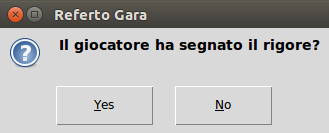

[//]: # (encoding=utf-8)

# Referto Gara v. 0.7

Il programma _Referto Gara_ assiste il refertista durante la gara occupandosi
di:

 * compilare l'elenco eventi (detto anche _progressivo analitico di gara_);
 * aggiornare in tempo reale il quadro relativo alle statistiche di squadra;
 * gestire le sospensioni dei giocatori;
 * visualizzare il tempo di gioco e il punteggo sul tabellone.

## Prerequisiti

Affinché il programma possa comunicare con il circuito di controllo del
tabellone è necessaria la presenza dei driver della scheda Arduino. I sistemi
operativi più moderni (es. Windows 10 e le principali distribuzioni Linux con
kernel v. 2.6 o successivo) supportano nativamente i circuiti basati su
Arduino; in questo caso è sufficiente collegare il circuito di controllo al
computer ed attendere la conferma dell'avvenuto riconoscimento della scheda.
In caso problemi o di uso di sistemi operativi più datati bisogna procedere
all'installazione manuale dei driver, che si possono scaricare gratuitamente
dal sito ufficiale all'indirizzo
[https://www.arduino.cc](https://www.arduino.cc). La procedura di installazione
varia a seconda del sistema operativo usato. Si rimanda alle tante guide che si
trovano in rete, anche in italiano, per le istruzioni del caso.

## Predisposizione del sistema

Attenersi alla seguente procedura di avvio:

 1. accendere il computer;
 2. collegare il circuito di controllo a una presa USB del computer;
 3. avviare il programma;
 4. collegare il cavo del tabellone al circuito di controllo.

Per lo spegnimento, eseguire la procedura all'inverso.

## Configurazione iniziale

All'avvio del programma appare la maschera di configurazione:

I parametri della configurazione sono:

 * **Tipo di partita**: scegliere _Campionato_ se si tratta di una partita
   da due tempi regolamentari, _Eliminazione diretta_ se sono previsti pure i
   tempi supplementari ed eventuali rigori;

 * **Durata di un tempo**: durata di una frazione di gioco, espresso in minuti;

 * **Mostra il tempo aggregato**: mostra il tempo di gioco relativo all'inizio
   della partita anziché all'inizio della frazione di gioco;

 * **Mostra lo zero iniziale nei minuti**: aggiunge lo zero delle decine quando
   il numero di minuti è inferiore a 10. Supponendo di trovarsi al minuto 7
   e 42 secondi di gioco, questa opzione consente di visualizzare l'orario
   **07:42** anziché **7:42**;

 * **Mostra i decimi di secondo nell'ultimo minuto**: mostra secondo, centesimo
   di secondo (arrotondato alla decina precedente) anzichè minuto, secondo nel
   contaminuti durante l'ultimo minuto di ogni frazione di gioco;

 * **Suona la sirena di fine tempo**: emette un suono di sirena della durata di
   un secondo al termine di ogni frazione di gioco;

 * **Mostra lo scorrere del minuto di timeout**: mostra lo scorrere dei secondi
   durante i timeout anziché il tempo di gioco in cui il timeout è stato
   chiamato;

 * **Suona la sirena di inizio timeout**: emette un suono di sirena della
   durata di un secondo alla chiamata di un timeout;

 * **Suona la sirena di imminente fine del timeout**: emette un suono di sirena
   della durata di un secondo a dieci secondi dal termine del timeout;

 * **Mostra le chiamate dei timeout sul tabellone**: mostra il numero di
   timeout chiamati con gli indicatori del tabellone (1T per il primo timeout,
   2T per il secondo, 1T e 2T per il terzo e ultimo timeout);

 * **Nome del dispositivo**: identificativo della porta cui è collegato il
   circuito di controllo del tabellone. Su Windows è il nome di una porta
   seriale (es. **COM3**), su Linux il nome di un pseudo-terminale (es.
   **/dev/ttyACM0**).

Il programma salva i parametri nel file
_.sps-hc20_report.cfg_ che si trova tipicamente nella cartella
_C:\Users\%USERNAME%_ su Windows, nella cartella _$HOME_ su Ubuntu, per cui
la configurazione non viene persa alla chiusura del programma.

Nel caso non sia stato possibile stabilire la comunicazione con il circuito di
controllo (es. il circuito non è stato connesso al computer, il nome del
dispositivo specificato non è quello corretto, ...) appare un messaggio d'errore
che indica la natura del problema e spiega che il programma funzionerà comunque
ma senza tabellone:

Conviene a questo punto chiudere il programma e risolvere il problema
contingente. Se si desidera invece utilizzare il programma senza il circuito di
controllo del tabellone, conviene lasciare vuoto il nome del dispositivo; in
questo caso apparirà un messaggio che riconosce la volontà di procedere senza
tabellone:

## Maschera principale

La parte superiore della maschera contiene il contaminuti, che è controllato dai
tre pulsanti dall'ovvio significato **Avvia** (**Pausa**), **Cambia** e
**Azzera**. Il contaminuti è gestito automaticamente dal programma: sono rari i
casi in cui si renda necessario controllare il contaminuti attraverso questi
pulsanti (es. aggiustamento del tempo a causa di un errato uso del programma,
sospensioni impreviste del gioco, particolari richieste dell'arbitro, ...).
L'opzione **Ferma il contaminuti durante i rigori** arresta il conteggio del
tempo durante i tiri dai 7 metri. Alla sua destra si trova l'indicatore della
fase di gioco corrente.

Nella parte centrale della maschera a sinistra si trovano i pulsanti relativi
agli eventi di gioco, al centro l'elenco degli eventi già registrati, a destra
le statistiche relative ai giocatori delle due squadre e più sotto l'area ove
vengono visualizzate le sospensioni in corso.

La parte inferiore della maschera contiene i pulsanti di controllo del
programma: **Salva...** salva l'elenco degli eventi in un file di testo in
formato CSV, **Cancella Evento** rimuove dall'elenco l'evento selezionato. Il
pulsante **Sirena** aziona la sirena: il suono viene emesso fintantoché il
pulsante è premuto. Il pulsante **Comunicato** consente di far apparire un
testo scorrevole nei quattro display del contaminuti (quelli rossi),
**Configura** richiama la maschera di configurazione iniziale, utile nel caso
si voglia modificare il funzionamento del programma "in corsa",
**Esci** termina la sessione di lavoro.

## Uso del programma

All'avvio il programma si trova in modalità _PREPARTITA_. Al fischio
dell'arbitro si preme il pulsante **Inizio 1° Tempo** per indicare al programma
che la partita ha avuto inizio; il programma passa quindi in modalità
_1° TEMPO_, l'etichetta del pulsante appena premuto cambia in **Fine 1° Tempo**
e inizia il conteggio del tempo. Entrati in una fase attiva di gioco tutti i
pulsanti relativi agli eventi si abilitano, ed è così possibile cominciare a
registrare le varie situazioni di gioco.

### Goal

Il pulsante **Goal** consente di registrare la segnatura di una rete; una
volta premuto compare una prima maschera che richiede di indicare la squadra
di appartenenza del giocatore:

Una seconda maschera consente di specificare il numero del giocatore che ha
realizzato il goal:

Il tasto **Annulla** elimina l'evento che non viene quindi registrato.

### Timeout

Il pulsante **Timeout** consente di registrare la chiamata di un timeout; una
volta premuto compare la maschera di selezione della squadra che ha effettuato
la richiesta:

Non appena l'evento viene confermato il programma entra in modalità _TIMEOUT_:
l'etichetta del pulsante cambia in **Fine Timeout** e, in funzione della
parametrizzazione corrente, viene dapprima emesso un suono di sirena della
durata di un secondo (cfr. parametro _Suona la sirena di inizio timeout_),
quindi il tempo di gioco nel contaminuti -- ora sospeso -- viene sostituito con
quello del timeout (cfr. parametro _Mostra lo scorrere del minuto di timeout_).
Al raggiungimento del cinquantesimo secondo di timeout, sempre se richiesto,
viene emesso un ulteriore suono di sirena della durata di un secondo (cfr.
parametro _Suona la sirena di imminente fine del timeout_). Esaurito il minuto
di timeout, sul contaminuti riappare il minuto, secondo di interruzione del
gioco. Il conteggio del tempo di gioco ricomincia alla successiva pressione del
pulsante **Fine Timeout**, **anche se il minuto di timeout non è stato
completato.**

### Ammonizione

Le ammonizioni vengono gestite analogamente all'evento **Goal**, richiedendo
prima la squadra di appartenenza del giocatore ammonito, quindi il suo numero
di maglia.

### 2 Minuti

Le ammonizioni vengono gestite analogamente all'evento **Goal**, richiedendo
prima la squadra di appartenenza del giocatore sospeso, quindi il suo numero
di maglia. La sospensione appare nel riquadro di competenza in basso a destra,
dove viene riportato il numero del giocatore e il tempo di gioco in cui la
sospensione avrà termine. L'indicazione della sospensione scompare
automaticamente al suo compimento.

### Squalifica

Le squalifiche vengono gestite analogamente all'evento **Goal**, richiedendo
prima la squadra di appartenenza del giocatore squalificato, quindi il suo
numero di maglia.

### Rigore

I tiri di rigore vengono gestiti analogamente all'evento **Goal**, richiedendo
prima la squadra di appartenenza del giocatore che sta per tirare il rigore,
quindi il suo numero di maglia; in più, il conteggio del tempo di gioco viene
sospeso se l'opzione _Ferma il contaminuti durante i rigori_ è attiva. Il
programma chiede infine di specificare se il giocatore che ha effettuato il
tiro ha realizzato il goal:

### Fine del primo tempo

Al termine della prima frazione di gioco il programma arresta automaticamente
il contaminuti, ma rimane in modalità _1° TEMPO_ per consentire di registrare
eventuali eventi verificatisi in prossimità del termine della fine del primo
tempo. È necessario premere il pulsante **Fine 1° Tempo** per registrare
l'evento di chiusura della prima frazione di gioco; il programma entra così in
modalità _INTERVALLO_, l'etichetta del pulsante cambia in **Inizio 2° Tempo**
e gli altri pulsanti evento vengono disabilitati.

### Frazioni di gioco successive

La gestione delle frazioni di gioco successive ricalca quella del primo tempo.
In funzione del tipo di partita selezionata, la successione delle fasi e delle
etichette del pulsante di avanzamento di fase sono:

 * Partita di campionato

    |   Modalità      | Pulsante di fase |
    |:----------------|:-----------------|
    | PREPARTITA      | Inizio 1° Tempo  |
    | 1° TEMPO        | Fine 1° Tempo    |
    | INTERVALLO      | Inizio 2° Tempo  |
    | 2° TEMPO        | Fine 2° Tempo    |
    | FINE PARTITA    | -                |

 * Partita a eliminazione diretta

    |   Modalità      | Pulsante di fase |
    |:----------------|:-----------------|
    | PREPARTITA      | Inizio 1° Tempo  |
    | 1° TEMPO        | Fine 1° Tempo    |
    | INTERVALLO      | Inizio 2° Tempo  |
    | 2° TEMPO        | Fine 2° Tempo    |
    | INTERVALLO      | Inizio 1° T.S.   |
    | 1° TEMPO SUPPL. | Fine 1° T.S.     |
    | INTERVALLO      | Inizio 2° T.S.   |
    | 2° TEMPO SUPPL. | Fine 2° T.S.     |
    | INTERVALLO      | Rigori           |
    | RIGORI          | Fine Partita     |
    | FINE PARTITA    | -                |

   Il programma entra in modalità _1° TEMPO SUPPL._ e _RIGORI_
   solamente se la fase di gioco precedente è terminata in parità.

### Esempio

La schermata mostra il programma in uso durante una partita: si nota che le
statistiche di squadra sono aggiornate in tempo reale, compreso il numero di
reti segnate da ogni giocatore. Guardando l'area delle sospensioni si può
verificare che ce n'è una in corso, a carico del giocatore numero 3 della
squadra di casa (squadra A). La sospensione avrà termine al minuto 28:22 del
primo tempo.

### Elenco eventi

È possibile salvare l'elenco degli eventi in un file di testo in formato CSV
per successive elaborazioni; premendo il pulsante **Salva...** il programma
chiede di specificare il nome del file e procede con il salvataggio.
**Cancella evento** consente di cancellare l'evento selezionato, previa
conferma. Una volta cancellato, i riquadri delle statistiche di squadra e delle
sospensioni in corso sono aggiornati di conseguenza.

### Comunicato

È possibile far apparire una scritta scorrevole sul contaminuti. Valutare bene
questa opportunità: trattandosi di display sette segmenti la rappresentazione
di alcuni caratteri (es. K, M, Q, R, U, V) può risultare di difficile
interpretazione. Una prova preliminare è d'obbligo.

Premendo il pulsante **Comunicato** appare la maschera omonima:

Impostato il testo del messaggio da visualizzare e la velocità di scorrimento
delle lettere sul tabellone (_Bassa_, _Media_ e _Alta_), premere **Mostra**
per iniziare. Il comunicato sostituisce il contaminuti fino a che non viene
premuto il tasto **Nascondi** e comunque alla chiusura della maschera. La
visualizzazione del comunicato non interrompe un eventuale conteggio
sottostante. **Attenzione: il testo scorrevole appare solo sul tabellone,
non sullo schermo del computer.**

## Utilizzo della tastiera

L'uso del programma diventa assai più veloce se si utilizza la tastiera.
La tabella sottostante mostra i tasti associati ai principali pulsanti:

 | Pulsante          | Tasto   |
 |:------------------|:--------|
 | Annulla           | [Esc]   |
 | OK                | [Invio] |
 | Cancella Evento   | [Canc]  |
 | Squadra A         | A       |
 | Squadra B         | B       |
 | Cifre             | 0-9     |
 | Inizio/Fine Tempo | P       |
 | Goal              | G       |
 | Timeout           | T       |
 | Ammonizione       | A       |
 | 2 Minuti          | 2       |
 | Squalifica        | S       |
 | Rigore            | R       |

Per registrare la sospensione di due minuti per il giocatore numero 14 della
squadra B è dunque sufficiente premere la sequenza di tasti:

        2 B 1 4 [Invio]

## Inconsistenze

In alcuni rari casi la cancellazione di un evento può generare una situazione
incompatibile con le regole della pallamano. In tale evenienza il programma
mostra una maschera dove sono raccolte tutte le inconsistenze registrate, in
modo da facilitare la loro sistemazione:

Nell'esempio è stato erroneamente cancellato l'evento di fine di primo tempo,
e il programma segnala che un evento di timeout chiamato durante il secondo
tempo ora risulta essere chiamato durante l'intervallo, cosa che non è
consentita dal regolamento.

## Punti aperti

### Modifica di un evento

Non è possibile modificare un evento una volta registrato, per esempio per
cambiare il numero del giocatore coinvolto o la natura dell'evento stesso; è
necessario cancellarlo e sostituirlo con l'evento corretto. La sostituzione
può rivelarsi difficoltosa se nel frattempo sono stati registrati altri eventi.

### Dirigenti e allenatori

Il programma non gestisce le ammonizioni, le sospensioni e le squalifiche a
carico di dirigenti e allenatori. Il problema può essere aggirato assegnando
ai due ruoli dei numeri di maglia dedicati (es. 0 e 99), e trattandoli come
fossero due giocatori aggiuntivi.
